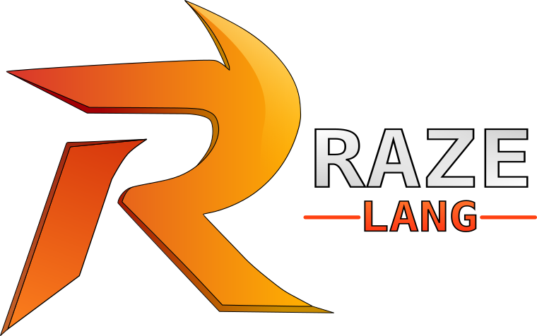

<div align="center">

# Raze



**A Modern C-Like Programming Language**


<br>


</div>


## About

Raze is a Compiled, Object Oriented, Statically & Strictly typed programming language that combines all the intuitive features from languages such as C, C#, and Python into a neat syntax, while also offering access to lower level programming.

## Syntax

Raze's syntax resembles other C-Family languages such as C and C#.

Example:

```py 

# Hello-World in Raze

```

```js

function Main()
{
    Print("Hello, World!");
}

```

For a more formal writeup of Raze, see the CFG [here](CFG.md)

See all the code examples [here](Raze-Driver/Examples)

### Syntax Highlighting

Please refer to the [Raze Language Support](https://github.com/Ezlanding1/Raze-Language-Support) repo for instructions on adding syntax highlighting in Raze.

## How to Install and Run

### Install from Release

Download the latest version of the Raze compiler from the [Releases Page](https://github.com/Ezlanding1/Raze/releases) and add the executable's location to PATH (or run the `raze`/`raze.exe` program in the unzipped folder directly)

Feel free to familiarize yourself with the language with the [examples](Raze-Driver/Examples/)

### Build from Source
> Requires .NET 8.0 or greater

Clone the repository:
```bash
git clone https://github.com/Ezlanding1/Raze.git
cd Raze
```
Restore dependencies and build:
```bash
dotnet restore
dotnet publish -c Release
```

The compiled binary will be located at `Raze-Driver/bin/Release/net8.0/raze`

Add this directory to your PATH to use Raze globally.

## Compile & Run Code
Create a file ending with `.rz`, or use `raze init` to create a sample program.

Run the Raze program with
```bash
raze run Program.rz
```

Alternatively, use the `compile` option to compile the file to a standalone executable without running it
```bash
raze compile Program.rz
```

## Output Target Support

### Supported Platforms

| Operating System | Support | Notes |
|-----------------|:---:|-------|
| Windows         | ✅ | |
| Linux           | ✅ | |
| MacOS           | ❌ | Planned support |

### Supported Architectures

| Operating System | Support | Notes |
|-----------------|:---:|-------|
| x86-64         | ✅ | |
| arm64          | ❌ | Planned support |
| webassembly    | ❌ | Planned support |
| riscv64        | ❌ | |

## Cross-Compiling
To compile a Raze program for another platform, use the `--sysinfo-osabi=Platform` and `--sysinfo-architecture=Architecture` flags. For instance, I could compile `Program.rz` for a x86-64 Windows machine with
```bash
raze compile --sysinfo-osabi=Windows Program.rz
```
and the compiler will generate an `output.exe` file for Windows

## TODO
See the complete [TODO List](TODO.md) 

## Releases

`Raze Compiler ALPHA V0.0.0`  - MM/DD/YY
